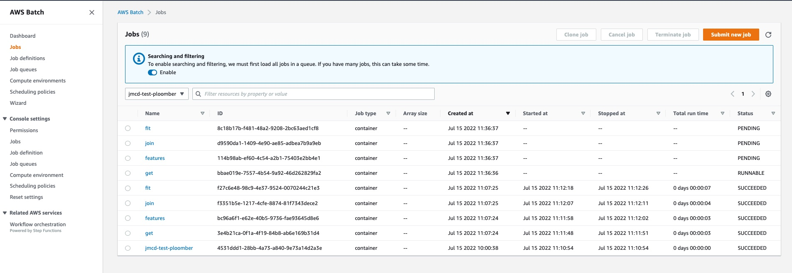

# ploomber-exemplar

The establishment of this code base was inspired by the article ["ML Without the Ops"](https://towardsdatascience.com/ml-without-the-ops-running-experiments-at-scale-with-ploomber-on-aws-29c4b78ff0fa).

The goal was to create a simple Ploomber compatiable application that can be run locally or on AWS Batch, through a single command differential. 

The application:
1. Retrieves an open source data source.
2. Generates features.
3. Performs a join between the raw data and the features.
4. Trains a basic model.

## Setup

### Prerequisites

- AWS ClI setup with credentials configured.

- Python 3.6+ installed.

### Setup Project 

At the project root run ```source setup.sh```. Thats it. It creates a virtual environment and installs depedencies.

### Run Locally

- Change directory to ```ml-basic```

- run ```ploomber build``` to execute all the Ploomber tasks locally. This will generate a folder of artifacts ```output```

### Cloud Resources on AWS

Note: Some cloud resources are already setup and configured if you intent to reuse (see file ```soopervisor.yaml```), but if you want to do it from scratch, follow these instructions.

1. Navigate to the AWS Batch console main home screen.

2. Select "Compute environment", give the environment a suitable name set up a EC2 provisioning model (Ploomber only supports EC2). You also **need** to select an approppriate VPC and subnets. You can accept the rest of the defaults for now until the environment is setup.

3. On the AWS Batch home screen select "Job Queues". I changed the name only an accepted all defaults until it was created.

4. Create a new ECR repository if desired to host Ploomber Docker images generated.

### Configure Cloud Resources in Project

1. If the file ```soopervisor.yaml``` does not exist, run ```soopervisor add batch --backend aws-batch``` which will create the file.

2. Update the appropriate values in ```soopervisor.yaml``` with your ECR repository (url and name) and AWS Batch queue name.

### Run Project on AWS Batch

- ```soopervisor export batch --skip-tests --ignore-git --mode force``` 

This will create and push a Docker image to your ECR repository and create multiple AWS Batch jobs, with each task as a job running as a DAG. The force flag is not needed if the output folder does not exists from a local run (caching)

You can use the AWS Batch console to monitor job status and even view logs via CloudWatch integration. The jobs should finish with a SUCCEEDED status.



## Improvements / Pain Points

- No effort was made to clean up the code, so its a bit rough.
- The Docker image push to ECR is slow on first push, it could be the Ploomber base image selected is not as efficient as it could be, given how lightweight this example application is. 
    - **It seems to only be slow the first time - some caching? might be slow again if code/requirements change**
- The article promised no ops, this is not true. it at least presumes some click ops will occur to configure AWS batch. While it was very simple to setup via the AWS console, this would need to become IaC in any mature application.
- AWS batch version does not spit out artifacts to S3 yet.
- No Tags on images.

## Resources
- https://soopervisor.readthedocs.io/en/latest/tutorials/aws-batch.html
- https://towardsdatascience.com/ml-without-the-ops-running-experiments-at-scale-with-ploomber-on-aws-29c4b78ff0fa
- https://ploomber.io/blog/survey/
- https://github.com/ploomber/ploomber